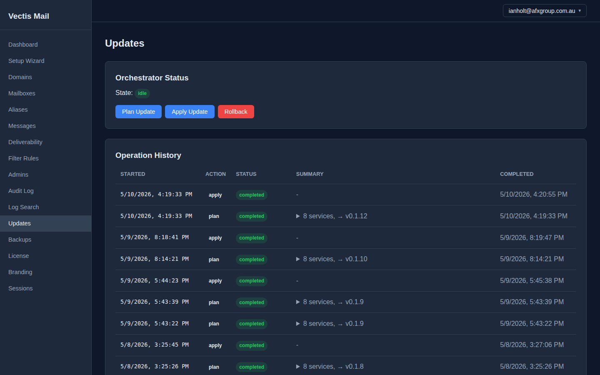

# Vectis Mail Server

A self-host mail server built on **Postfix, Dovecot, and Rspamd**, with a
REST API and admin UI on top. One YAML config; the orchestrator handles
atomic updates, rollback, and per-service reloads.

Built for operators who want the underlying mail stack (no reinventing) but
a modern operator surface (no manual config tweaking).

If you're choosing between Vectis Mail, [Mail-in-a-Box](https://mailinabox.email/),
and [Mailcow](https://mailcow.email/) — they all sit in the same self-host
mail niche with different trade-offs. Vectis prioritises declarative config
and a REST API; the others prioritise install simplicity (MIAB) and admin-UI
maturity (Mailcow).

**Marketing site:** https://vectismail.com
**Documentation:** https://vectismail.com/getting-started
**Pricing:** https://vectismail.com/pricing



## What's in the box

- **Mail stack:** Postfix, Dovecot, Rspamd; DKIM/SPF/DMARC out of the box.
- **Admin UI:** React + TypeScript dashboard for domains, mailboxes,
  aliases, deliverability, audit log, backups, and updates.
- **API:** authenticated REST endpoints for everything in the UI plus
  outbound sending (single + batch), inbound webhooks, and analytics.
- **Webmail:** Roundcube with a Vectis skin and ManageSieve filter rules.
- **Update orchestrator:** plan / apply / rollback rolling updates from
  the admin UI; atomic compose + image swaps.
- **Backups:** encrypted archives, scheduled or on-demand, with one-click
  restore from the admin UI.
- **Monitoring:** built-in Prometheus + Grafana + Loki.
- **TLS:** automatic via Traefik + acme.sh.

## Install

On a fresh Ubuntu 22.04+ VPS with port 25 unblocked and a PTR record
pointed at the host:

```bash
curl -fsSL https://dl.vectismail.com/latest/install.sh | sudo bash
```

(Or download `install.sh` first and inspect it — see the [installation
walkthrough](https://vectismail.com/getting-started/installation/) for the
full step-by-step.)

The installer provisions Postgres, Valkey, Postfix, Dovecot, Rspamd,
Traefik, the orchestrator, and the API container. Pre-flight checks
verify DNS, port 25 reachability, hostname/PTR alignment, and disk
space before any container starts.

## Tiers and licensing

Vectis is **source-available under the Business Source License 1.1**
(see [`LICENSE`](LICENSE)). Production use is governed by the
Additional Use Grant in that file:

- **Starter (Free):** up to 3 domains, up to 25 mailboxes per domain.
  No subscription required. Full webmail, sending API, monitoring,
  backups — see the pricing page for the complete list.
- **Pro ($29 USD / tenant / month):** unlimited domains and mailboxes,
  per-domain analytics, OIDC SSO, priority email support. One
  subscription covers every Vectis installation operated by your
  organisation. Activate by pasting your subscription ID on the
  admin UI License page after purchase.

Subscriptions are issued via [ValidonX](https://validonx.com),
Veltara Works's billing platform.

The Change Date is four years from each version's first publication;
on that date, the affected version converts to Apache License 2.0.

## Repository layout

```
cmd/vectis/        Go CLI + API entrypoint
internal/          Go packages: api, config, orchestrator, validonx, mail, ...
web/               React + TypeScript admin UI
migrations/        Postgres schema migrations (golang-migrate)
templates/         Service config templates (Postfix, Dovecot, Rspamd, compose)
docker/            Per-service Dockerfiles
docs/              Architecture, ADRs, internal notes
scripts/           Installer + utilities
```

## Issues, support, contact

- **Bug reports:** https://github.com/Veltara-Works/vectis/issues
- **Pro support tickets:** included with Pro subscription via ValidonX
- **Commercial enquiries:** sales@vectismail.com
- **Legal / licensing:** legal@vectismail.com
